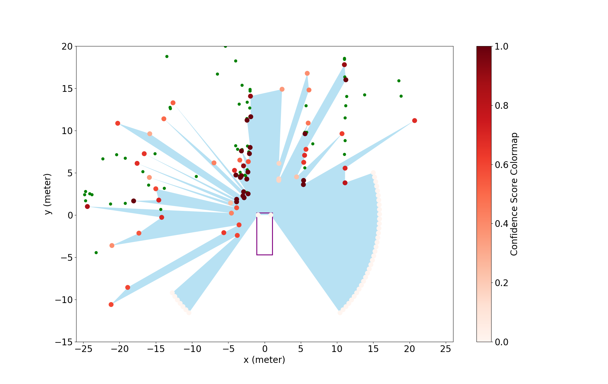
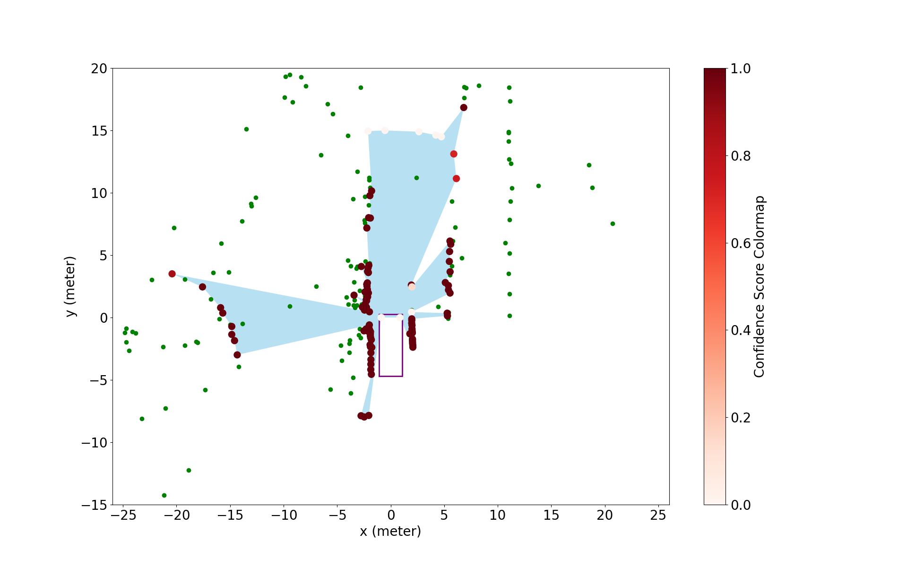
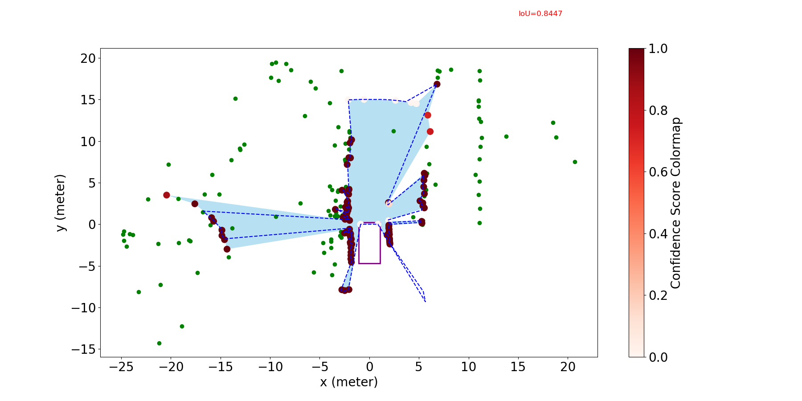
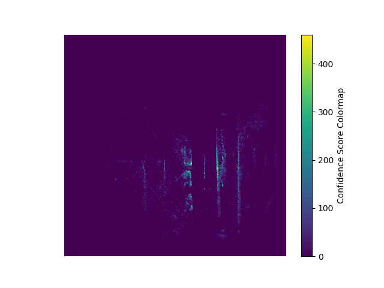

# Deformable Radar Polygon

A Lightweight and Predictable Occupancy Representation for Short-range Collision Avoidance

> [**Deformable Radar Polygon: A Lightweight and Predictable Occupancy Representation for Short-range Collision Avoidance**](https://arxiv.org/pdf/2203.01442.pdf),            
> *Xiangyu Gao, Sihao Ding, Karl Vanäs, Harshavardhan Reddy Dasari, and Henrik Söderlund*
> *arXiv technical report ([arXiv 2203.01442](https://arxiv.org/abs/2203.01442))*  

    @article{xiangyu2022deformable,
        title={Deformable Radar Polygon: A Lightweight and Predictable Occupancy Representation for Short-range Collision Avoidance},
        author={Xiangyu, Gao and Sihao, Ding and Karl, Vanas and Reddy, Dasari Harshavardhan and Henrik, Soderlund},
        journal={arXiv preprint arXiv:2203.01442},
        year={2022}}

## Update
***(Nov. 27, 2022) Code and sample data release.***

## Contact
Any questions or suggestions are welcome! 

Xiangyu Gao [xygao@uw.edu](mailto:xygao@uw.edu) 

## Abstract
Inferring the drivable area in a scene is a key capability for ensuring the vehicle avoids obstacles and enabling safe autonomous driving. However, a traditional occupancy grid map suffers from high memory consumption when forming a fine-resolution grid for a large map. In this paper, we propose a lightweight, accurate, and predictable occupancy representation for automotive radars working for short-range applications that take interest in instantaneous free space surrounding the sensor. This new occupancy format is a polygon composed of a bunch of vertices selected from noisy radar measurements, which covers free space inside and gives a Doppler moving velocity for each vertex. It not only takes a very small memory and computing resources for storage and updating at every timeslot but also has the predictable shape-change property based on vertex's Doppler velocity. We name this kind of occupancy representation *"deformable radar polygon"*. Two formation algorithms for radar polygon are introduced for both single timeslot and continuous inverse sensor model update. To fit this new polygon representation, a matrix-form collision detection method has been modeled as well. The radar polygon algorithms and collision detection model have been validated via extensive experiments with real collected data and simulations, showing that the deformable radar polygon is very competitive in terms of its completeness, smoothness, accuracy, lightweight as well as the shape-predictable property. 

## Use Deformable Radar Polygon

All radar configurations and algorithm configurations are included in [config](config.py).

### Software Requirement and Installation

Python 3.6, and libraries in [requirements.txt](requirements.txt).

### Download Sample Data
1. From below Google Drive link download the sample data 'scene.pickle'. 
    ```
    https://drive.google.com/file/d/12NV46iAPfws4SVUuxyfHbsqE_BibqAyK/view?usp=sharing
    ```
    Note that the sample data is from the scene 143 of [RadarScenes Dataset](https://radar-scenes.com/). You can try other data by downloading the RadarScenes, and read and save other scenes of data with the [script](read_radarscene_data.py).

2. Relocate the pickle data under the project directory.
    ```
    ./deformable_radar_polygon_occupancy_representation/scene.pickle
    ```

### Run Single-shot Radar Polygon Formation Algorithm
    
    python polygon_radarscene_singleFrame.py
    
The polygon results are saved in *'./results_polygon/radarScene143_poly'* as pickle file and their visualization is in *'./results_bev/radarScene143_poly'*.

One example for frame 36 is shown below:
<p align="center">  </p> 

### Run ISM-based Radar Polygon Update Algorithm
   
    python polygon_radarscene_inverseSensor.py
    
The polygon results are saved in *'./results_polygon/radarScene143_ism_poly'* as pickle file and their visualization is in *'./results_bev/radarScene143_ism_poly'*.

One example for frame 36 is shown below:
<p align="center">  </p> 

### Try Radar Polygon Prediction During the ISM Update
By enable *is_withpred* (i.e., set *is_withpred=True*) in [polygon_radarscene_inverseSensor.py](polygon_radarscene_inverseSensor.py), then run it as below
   
    python polygon_radarscene_inverseSensor.py
    
The polygon prediction results are visualization is in *'./results_bev/radarScene143_ism_poly_pred'* using the dotted line.

One example for frame 36 is shown below:
<p align="center">  </p> 

### Run the Reference Occupancy Grid Algorithm   
    python gridmap_radarScene_ism.py

By default it is running for [*Li et al.*](https://www.scitepress.org/papers/2018/66673/66673.pdf). By enable *is_werbe* (i.e., set *is_werbe=True*) in [gridmap_radarScene_ism.py](gridmap_radarScene_ism.py), you are able to change the default to [*Werber et al.*](https://ieeexplore.ieee.org/abstract/document/7117922).

The grid map results are saved in *'./results_gridmap/radarScene143_ism_Li'* by default and their visualization is in *'./results_bev/radarScene143_ism_Li'* by default.

One example for frame 36 is shown below:
<p align="center">  </p> 

### Evaluation 
    python evaluate_radarScenes.py

 You will get outputs as follows:
    
    iou_gt for single-shot polygon is:  0.39592379772256886
    iou_smooth for single-shot polygon is:  0.6115257985504882
    iou_gt for ISM-based polygon is:  0.7586416779279769
    iou_smooth for ISM-based polygon is:  0.8479761386842892
    96 1442
    mse for single-shot polygon is:  0.06657420249653259
    32 1442
    mse for ISM-based polygon is:  0.022191400832177532
    46 1442
    mse for grid map Li et al. is:  0.0319001386962552

## License

This project is release under MIT license (see [LICENSE](LICENSE)).

## Acknowlegement
This work was partially completed during the internship at Volvo Cars. Thanks so much for all the people who gave guidance or contributed to this project.
