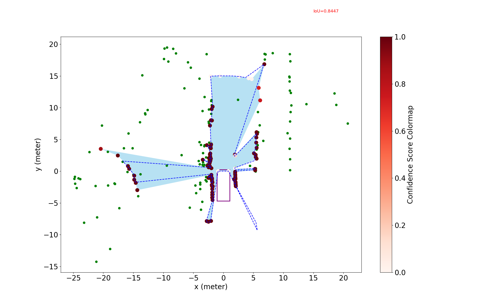

# Deformable Radar Polygon

A Lightweight and Predictable Occupancy Representation for Short-range Collision Avoidance

<p align="center">  </p> 


> [**Deformable Radar Polygon: A Lightweight and Predictable Occupancy Representation for Short-range Collision Avoidance**](https://arxiv.org/pdf/2203.01442.pdf),            
> *Xiangyu Gao, Sihao Ding, Harshavardhan Reddy Dasari*

> *IEEE Sensors Journal ([arXiv 2203.01442](https://arxiv.org/abs/2203.01442))*  

    @article{xiangyu2022deformable,
        title={Deformable Radar Polygon: A Lightweight and Predictable Occupancy Representation for Short-range Collision Avoidance},
        author={Xiangyu, Gao and Sihao, Ding and Reddy, Dasari Harshavardhan},
        journal={arXiv preprint arXiv:2203.01442},
        year={2022}}

## Update
***(July 4, 2024) Code and sample data release.***

## Abstract
Inferring the drivable area in a scene is crucial for ensuring a vehicle avoids obstacles and facilitates safe autonomous driving. In this paper, we concentrate on detecting the instantaneous free space surrounding the ego vehicle, targeting shortrange automotive applications. We introduce a novel polygonbased occupancy representation, where the interior signifies free space, and the exterior represents undrivable areas for the egovehicle. <u>*The radar polygon consists of vertices selected from point cloud measurements provided by radars, with each vertex incorporating Doppler velocity information from automotive radars.*</u> This information indicates the movement of the vertex along the radial direction. This characteristic allows for the prediction of the shape of future radar polygons, leading to its designation as a <u>“deformable radar polygon”</u>. We propose two approaches to leverage noisy radar measurements for producing accurate and smooth radar polygons. The first approach is a <u>basic radar polygon formation algorithm</u>, which independently selects polygon vertices for each frame, using SNR-based evidence for vertex fitness verification. The second approach is the radar polygon update algorithm, which employs a <u>probabilistic and tracking-based mechanism to update the radar polygon over time</u>, further enhancing accuracy and smoothness. To accommodate the unique radar polygon format, we also designed a collision detection method for short-range applications. Through extensive experiments and analysis on both a self-collected dataset and the open-source RadarScenes dataset, we demonstrate that our radar polygon algorithms achieve significantly higher IoU-gt and IoUsmooth values compared to other occupancy detection baselines, highlighting their accuracy and smoothness.

## Use Deformable Radar Polygon

All radar configurations and algorithm configurations are included in [`config.py`](config.py).

### Software Requirement and Installation

Python 3.6, and libraries in [`requirements.txt`](requirements.txt).

### Download Sample Data
1. From below Google Drive link download the sample data 'scene.pickle'. 
    ```
    https://drive.google.com/file/d/12NV46iAPfws4SVUuxyfHbsqE_BibqAyK/view?usp=sharing
    ```
    Note that the sample data is from the scene 143 of [RadarScenes Dataset](https://radar-scenes.com/). You can try other data by downloading the RadarScenes, and read and save other scenes of data with the [`read_radarscene_data.py`](read_radarscene_data.py).

2. Relocate the pickle data under the project directory.
    ```
    ./deformable_radar_polygon_occupancy_representation/scene.pickle
    ```

### Run Basic Radar Polygon Formation Algorithm
    
    python polygon_radarscene_singleFrame.py
    
The polygon results are saved in `./res/results_polygon/radarScene143_poly` as pickle file and their visualization is in `./res/results_bev/radarScene143_poly`.

One example for 36-th frame is shown below:
<p align="center">  </p> 

### Run Probabilistic and Tracking-Based Radar Polygon Update Algorithm
   
    python polygon_radarscene_inverseSensor.py
    
The polygon results are saved in `./res/results_polygon/radarScene143_ism_poly` as pickle file and their visualization is in `./res/results_bev/radarScene143_ism_poly`.

One example for 36-th frame is shown below:
<p align="center">  </p> 

### Try Radar Polygon Prediction During the Radar Update
By enable `is_withpred` argument (i.e., set `is_withpred=True`) in [`polygon_radarscene_inverseSensor.py`](polygon_radarscene_inverseSensor.py), then run it as below
   
    python polygon_radarscene_inverseSensor.py
    
The polygon prediction results are visualization is in `./res/results_bev/radarScene143_ism_poly_pred` using the dotted line.

One example for 36-th frame is shown below:
<p align="center">  </p> 

### Run the Meerpohl Polygon Algorithm   
    python meerpohl_polygon_radarscene.py

By default it is running with the algorithm in [*"Free-space Polygon Creation based on Occupancy Grid Maps for Trajectory Optimization Methods"*](https://www.sciencedirect.com/science/article/pii/S2405896319304410).

The polygon results are saved in './res/results_poly/radarScene143_meerpohl'* by default and their visualization is in `./res/results_bev/radarScene143_meerpohl` by default.

One example for 36-th frame is shown below:
<p align="center">  </p> 

### Run the Ziegler Polygon Algorithm   
    python ziegler_polygon_radarscene.py

By default it is running with the algorithm in [*"Trajectory planning for Bertha — A local, continuous method"*](https://ieeexplore.ieee.org/document/6856581).

The polygon results are saved in `./res/results_poly/radarScene143_ziegler` by default and their visualization is in `./res/results_bev/radarScene143_ziegler` by default.

One example for 36-th frame is shown below:
<p align="center">  </p> 

### Evaluation 
    python evaluate_radarScenes.py

 You will get outputs as follows:

    iou_gt for single-shot polygon is:  0.23665013401606833
    iou_smooth for single-shot polygon is:  0.6891232717900692
    conf_over_time for single-shot polygon is:  0.4402510760276303
    iou_gt for ISM-based polygon is:  0.7444365353468597
    iou_smooth for ISM-based polygon is:  0.8686911700136964
    conf_over_time for single-shot polygon is:  0.8507623585611993
    iou_gt for Meerpohl polygon is:  0.22913116594233784
    iou_smooth for Meerpohl polygon is:  0.7055480795292997
    conf_over_time for Meerpohl polygon is:  0.7871844333735922
    iou_gt for Ziegler polygon is:  0.18980806214888435
    iou_smooth for Ziegler polygon is:  0.7323046792766466
    conf_over_time for Ziegler polygon is:  0.26333780394030987

### Try the Collision Detection Algorithm on Polygon
    python collison_detect_test.py

## License

This project is release under MIT license (see [LICENSE](LICENSE)).

## Acknowlegement
This work was partially completed during the internship at Volvo Cars. Thanks so much for all the people who gave guidance or contributed to this project.
